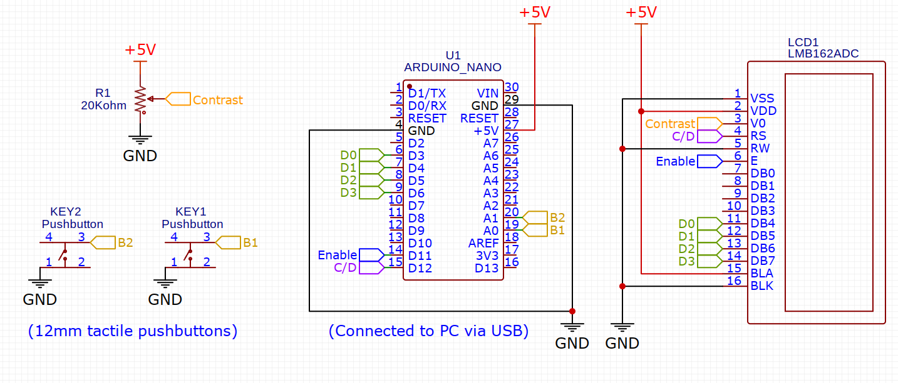

# Arduino Code

This part of the project borrows heavily from [arduino-lcdproc](https://github.com/TimeTravel-0/arduino-lcdproc) plus some tutorials.

The sketch initializes the screen, and has a timeout function when is not receiving data.

It also reads the status of the buttons and sends A or B whenever one is pressed.

Is not really complex, but doesn't need to be.

Using this script also has the nice extra bonus of being compatible with LCDProc serializer mode, though the buttons won't be supported.

# The circuit

The circuit is fairly simple, the only complication is finding the proper resistance wiper for your project. Mine could have used a 30K. At 20K it simply goes from nothing until you reach like 90% and then it kicks right in into the visible territory. 

My screen did not have backlight: If yours has, it may be a good idea to put a resistor in the BLA pin. Arduino tutorials recommend 220 ohm.

Originally This project embedded the circuit directly into the screen but I had issues routing the USB cable so I ended up separating the circuit and routing everything with cables. On the other hand this simplifies cable routing enormously.

