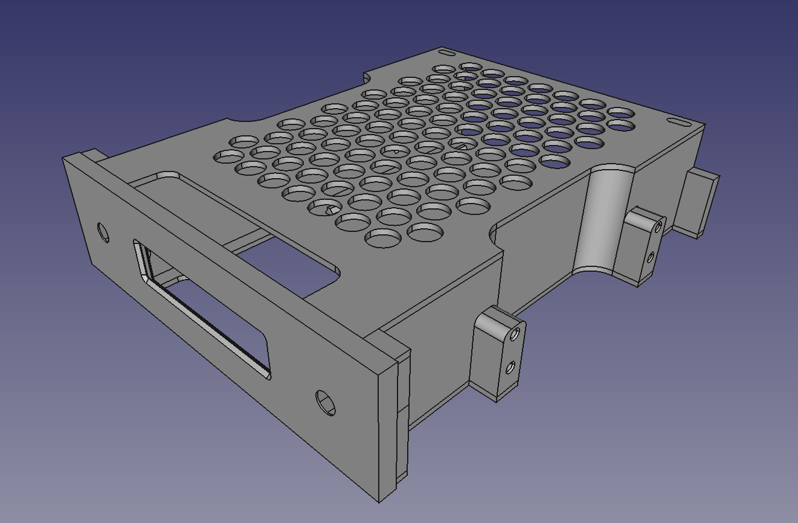

# The 3D model

The model consists of a base that (loosely) follows the CD-ROM standard measures that you can find on the "References" folder, a faceplate that houses the screen and the buttons, and a top cover that ties everything in a nice package. It has a space for fitting a 2.5 inch hard drive.

Everything is either press fitted, or secured with M3/M4 screws.

One could modify only the faceplate to fit a different LCD if needed, though most HD44780 clones I've seen have similar measures.
