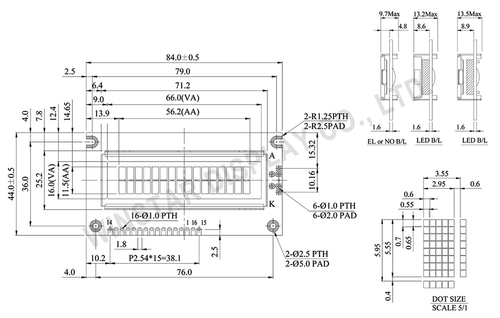
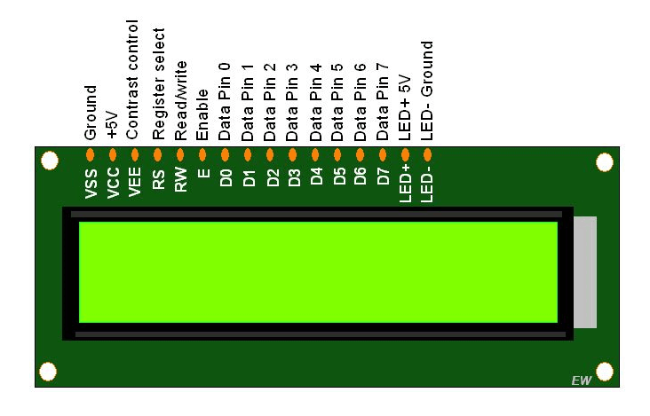
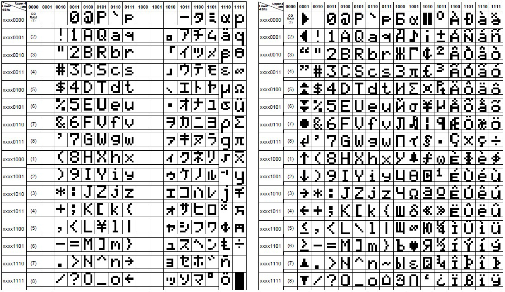

# Documents
* SF-8551.PDF: Specifications for CD-ROM drives. The last two pages include all measurements you need to make your own 5 1/2 inch half height enclosure.
* HD44780U.PDF: Datasheet for the original chip. Includes specific documentation about how characters are stored that most pages ignore.

# Links
* [systeminformation node library](https://systeminformation.io): This is the library I used to collect info from the system
* [serialport library](https://serialport.io): This is the library that enables node.js interface with the LCD

# Images

Physical specifications for the 1602 LCD. Most follow similar patterns. I checked mine against those with a caliper and fit decently.

LCD pinout. Most of not all LCDs have the same pinout, but also they lack any kind of labeling so it is a good idea to have it handy.

Charset map for the two more common ROMS. 
